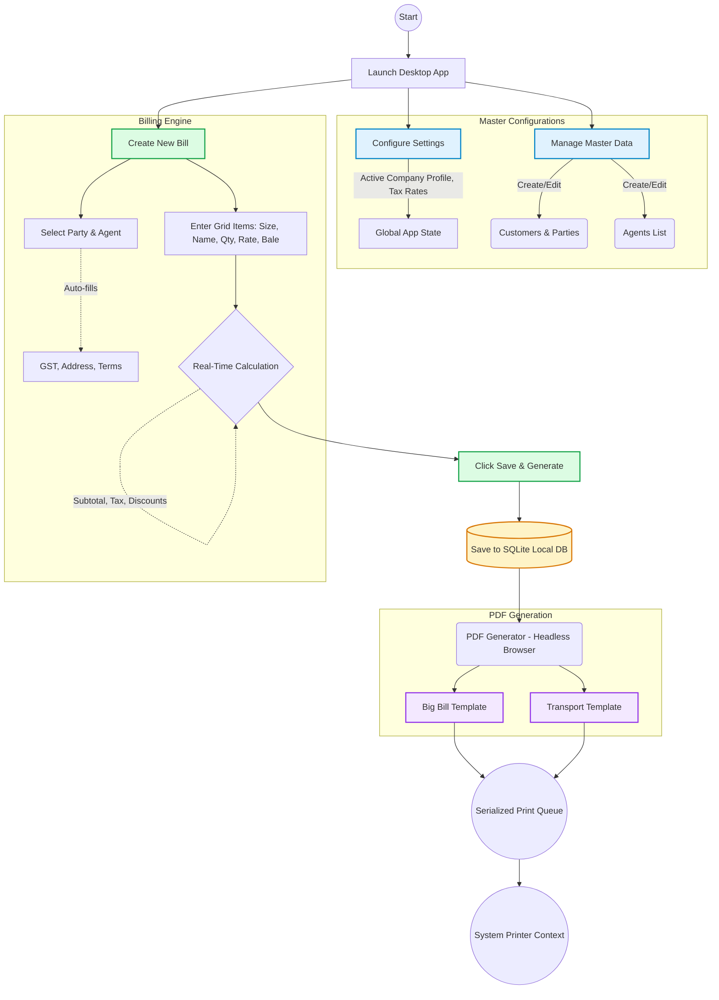
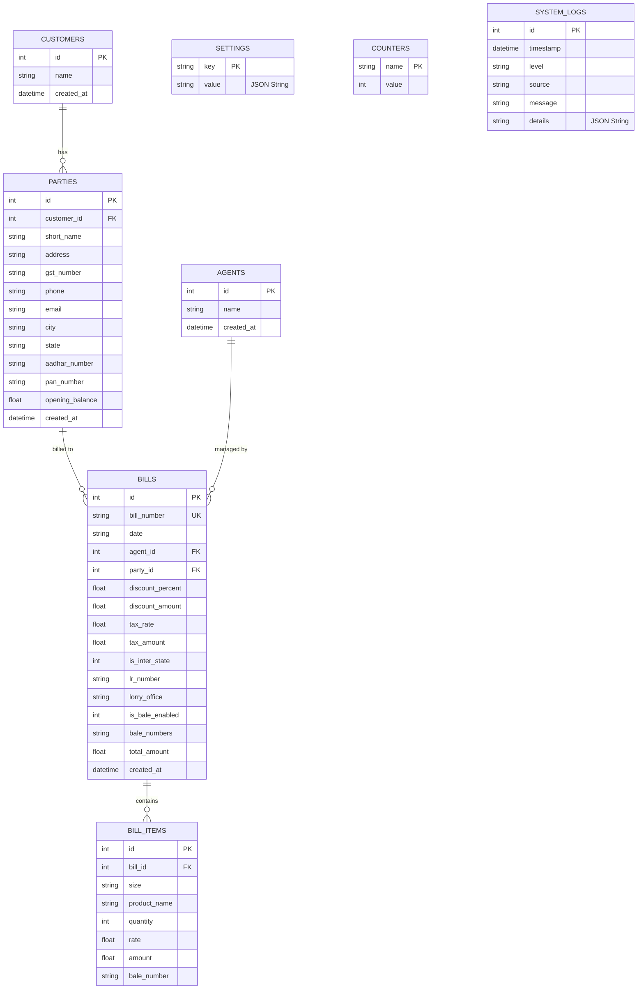

# Dhanalakshmi Textiles Billing Software

A modern, fast, and feature-rich desktop billing application built specifically for Dhanalakshmi Textiles. This application streamlines daily invoicing, reporting, and customer management, replacing manual paperwork with a sleek digital workflow.

## 🚀 Key Features

* **Quick Invoicing System**: Rapidly create new bills with **atomic auto-incrementing bill numbers** and autocomplete for parties and items.
* **Dual Print Formats**: Automatically generate professional invoices via external HTML templates:
  * **Big Print**: Standard full-sized invoice with full taxation and discount breakdown.
  * **Transport Print**: Condensed slip formats (2 per A4) optimized for transport handling.
* **Service-Oriented Architecture**: Cleanly separated business logic (Services) from presentation (Templates).
* **Robust Concurrency**: Serialized print queue ensures stability during rapid invoice generation.
* **Party Management**: Track buyers, agents, and their details (GST, PAN, Aadhaar) in a high-performance local database.
* **Sales Audit & Reporting**: Robust modules to filter by date, search transactions, batch print, and export to CSV.
* **Data Robustness**: Automated daily backups (rolling 7 days) and structured audit logging for traceability.
* **Offline First**: Entirely self-contained application using local SQLite. No internet required.

## 🛠️ Technology Stack

* **Frontend Framework**: React 19 + Vite 7
* **Desktop Environment**: Electron 41
* **Styling**: Tailwind CSS (Material 3 Design System)
* **Database**: SQLite3 (WAL mode enabled for high concurrency)
* **Templating**: Plain HTML/CSS templates with {{TOKEN}} replacement engine
* **Icons**: Lucide React
* **Notifications**: Sonner

## 🔧 Installation & Setup

1. **Clone or Download the Repository**.
2. **Install Dependencies**:
   ```bash
   npm install
   ```
   *Note: If SQLite bindings fail, run `npm run rebuild-sqlite`.*
3. **Run Development Server**:
   ```bash
   npm run dev
   ```

## 📦 Building/Packaging for Production

To create a standalone setup executable (`.exe` for Windows):
```bash
npm run package
```
Output installers are placed in the `release/` directory.

---

## 🏗️ Architecture & Workflows

### Application Workflow

The following flowchart illustrates the high-level workflow from configuration to final invoice generation and printing:



---

## 🗄️ Database Schema Design

The application uses **SQLite3** in **WAL (Write-Ahead Logging)** mode to ensure fast, zero-latency operations and high concurrency.

### ER Diagram



### Table Definitions

#### `customers` & `parties`
Branch/Location level details mapped to a parent customer grouping.
*   **Unique Constraint**: `parties(customer_id, short_name)` ensures no duplicate locations for a single client.

#### `bills` & `bill_items`
Core ledger. `bill_items` uses `ON DELETE CASCADE` to ensure data cleanliness.
*   **Performance**: Indexed on `bill_number`, `date`, and `party_id`.

#### `counters`
Manages **atomic bill number generation**.
*   **Mechanism**: Uses `UPDATE ... RETURNING` (SQLite 3.35+) to ensure race-condition-proof increments during concurrent saves.

#### `system_logs`
Structured audit trail for system events (saves, prints, backups).
*   **Maintenance**: Automatically prunes to the last 1000 entries on startup.

#### `settings`
Flexible Key-Value store for company profiles and UI preferences.

---

## 👥 Authors

Maintained by the IT infrastructure team for Dhanalakshmi Textiles.