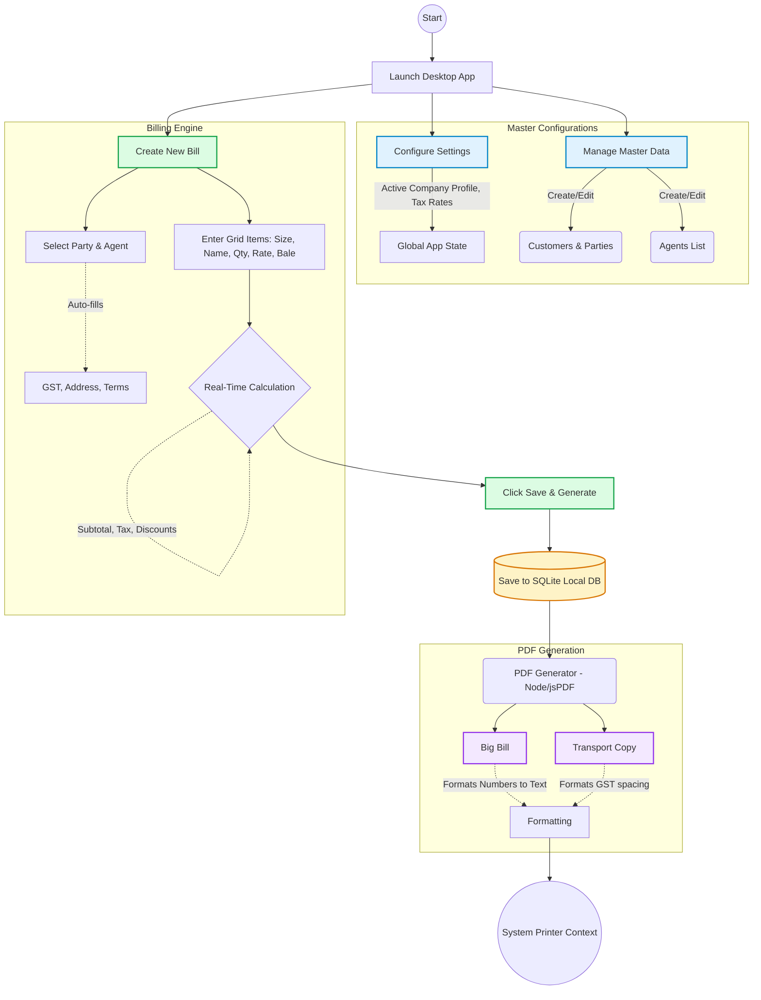
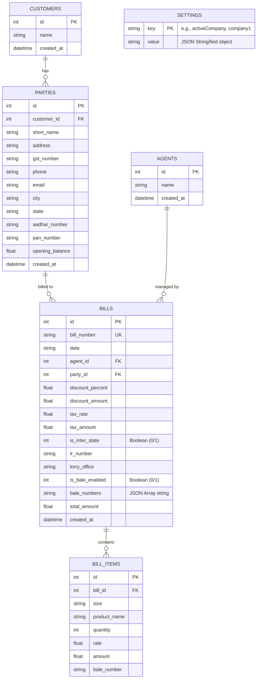

# Dhanalakshmi Textiles Billing Software

A modern, fast, and feature-rich desktop billing application built specifically for Dhanalakshmi Textiles. This application streamlines the daily invoicing, reporting, and customer management processes, replacing manual paperwork with a sleek digital workflow.

## 🚀 Key Features

* **Quick Invoicing System**: Rapidly create new bills with auto-incrementing bill numbers and autocomplete for parties and items.
* **Dual Print Formats**: Automatically generate and print professional invoices in two formats:
  * **Big Print**: Standard full-sized invoice containing full taxation and discount breakdown.
  * **Transport Print**: Condensed slip formats optimized for transport handling.
* **Party Management**: Keep track of buyers, agents, and their respective details (GST, PAN, Aadhaar) securely in a local database.
* **Sales Audit & Reporting**: Robust reporting module to filter sales by date ranges, search transactions, execute batch printing, and export financial summaries to CSV for accounting.
* **Beautiful Material 3 Design**: Built with a sleek, animated, and responsive user interface adopting Google's Material 3 design system.
* **Toast Notifications**: Integrated `sonner` provides non-obtrusive, aesthetic pop-up alerts.
* **Offline First**: Entirely self-contained application using local SQLite databases. No internet connection necessary for daily billing.
* **Data Backup & Recovery**: Native settings to export database backups (e.g., to a Pendrive) and restore them seamlessly.

## 🛠️ Technology Stack

* **Frontend Framework**: React 19 + Vite 7
* **Desktop Environment**: Electron 41
* **Styling**: Tailwind CSS (customized with Material Design 3 tokens)
* **Icons**: Lucide React
* **Notifications**: Sonner
* **Database**: SQLite3 (`sqlite3` module managed by Electron)
* **PDF Generation**: jsPDF & jsPDF-AutoTable

## 🔧 Installation & Setup

1. **Clone or Download the Repository** to your local machine.
2. **Install Dependencies**:
   Open a terminal in the project root and run:
   ```bash
   npm install
   ```
   *Note: If SQLite bindings fail to build, run `npm run rebuild-sqlite` to compile them against the current Electron version.*

3. **Run Development Server**:
   ```bash
   npm run dev
   ```
   This will simultaneously launch the React Vite server and the Electron desktop wrapper.

## 📦 Building/Packaging for Production

To create a standalone setup executable (`.exe` for Windows):

```bash
npm run package
```
or 
```bash
npm run build
```

The output installation files will be placed in the `release/` directory. By default, it builds an NSIS installer targeting Windows architectures (x64 and ia32).

## 💡 Workflow Examples

- **Single Bill Workflow**: Fill in party/item information -> Hit **Save & Generate**. System will save to DB, build PDF invoices (Big & Transport), and instantly send them via IPC to your default printer.
- **Batch Processing**: Navigate to **Reports**, select start and end invoice numbers, assign an LR range, and click **Print Big Bills** to automatically manage logistics paperwork at the end of the day.

## 👥 Authors

Maintained by the IT infrastructure team for Dhanalakshmi Textiles.


# Dhanalakshmi Textiles Billing Software

A modern, fast, and secure desktop billing software built specifically for textile wholesale and retail operations. The application is built using React (Vite) for the UI, styled with Tailwind CSS, and powered by Electron with a local SQLite database for offline-first, secure operations.

## Architecture & Workflows

### Application Workflow

The following flowchart illustrates the high-level workflow from configuration to final invoice generation and printing within the application:



---

## Database Schema Design

The entire application runs entirely locally. We use **SQLite3** to ensure fast, zero-latency database manipulation that doesn't rely on cloud hosting or network connectivity.

### ER Diagram



### Table Definitions

#### `customers`
Stores the highest-level entity for a customer grouping.
* `id` (INTEGER, PRIMARY KEY)
* `name` (TEXT, NOT NULL, UNIQUE)
* `created_at` (DATETIME)

#### `parties`
Branch/Location level details mapped directly to `customers` ID.
* `id` (INTEGER, PRIMARY KEY)
* `customer_id` (INTEGER, FOREIGN KEY)
* `short_name` (TEXT, NOT NULL) / *Unique alongside customer_id*
* `address`, `gst_number`, `phone`, `email`, `city`, `state`, `aadhar_number`, `pan_number` (TEXT)
* `opening_balance` (REAL, DEFAULT 0)
* `created_at` (DATETIME)

#### `agents`
Directory for sales representatives or agents.
* `id` (INTEGER, PRIMARY KEY)
* `name` (TEXT, NOT NULL, UNIQUE)
* `created_at` (DATETIME)

#### `bills`
Core ledger for all invoices generated.
* `id` (INTEGER, PRIMARY KEY)
* `bill_number` (TEXT, NOT NULL, UNIQUE)
* `date` (TEXT)
* `agent_id` (INTEGER, FOREIGN KEY -> `agents(id)`)
* `party_id` (INTEGER, FOREIGN KEY -> `parties(id)`)
* `discount_percent` (REAL)
* `discount_amount` (REAL)
* `tax_rate` (REAL)
* `tax_amount` (REAL)
* `is_inter_state` (INTEGER) / *Stores 1 for true, 0 for false (handles CGST+SGST vs IGST)*
* `lr_number` (TEXT)
* `lorry_office` (TEXT)
* `is_bale_enabled` (INTEGER)
* `bale_numbers` (TEXT) / *Stored as JSON representation of array*
* `total_amount` (REAL)
* `created_at` (DATETIME)

#### `bill_items`
Row-level detail referencing a parent `bills(id)`.
* `id` (INTEGER, PRIMARY KEY)
* `bill_id` (INTEGER, NOT NULL, FOREIGN KEY -> `bills(id)`)
* `size` (TEXT)
* `product_name` (TEXT, NOT NULL)
* `quantity` (INTEGER)
* `rate` (REAL)
* `amount` (REAL)
* `bale_number` (TEXT)

#### `settings`
Key-Value storage system allowing dynamic configuration modifications (Multi-Company context, print formatting, defaults) without schema disruption.
* `key` (TEXT, PRIMARY KEY)
* `value` (TEXT) / *Typically stores object graphs serialized via JSON*